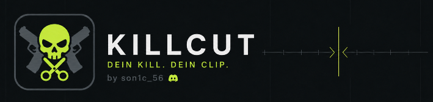

<h1>Killcut – FiveM Clip-Cutter</h1>

<h3>DEIN KILL. DEIN CLIP.</h3>

by son1c_56

Killcut ist ein lokaler Desktop-Clip-Cutter für FiveM-Gameplay-Aufnahmen. Alle Videos werden direkt auf dem eigenen PC verarbeitet und nicht auf externe Server hochgeladen.

## Download

[Hier findest du immer die neueste Version!](https://github.com/son1c56/killcut-clipcutter/releases/latest)

## Funktionen

- Läuft nur auf Windows
- Automatische Kill-Erkennung
- Unterstützung verschiedener Kill-Anzeigen und QR-Marker
- Einstellbarer Erkennungsbereich in der Videovorschau
- Anpassbare Empfindlichkeit und Markerfarbe
- Frei wählbarer Vor- und Nachlauf für erkannte Kills
- Manueller Schnittmodus mit In- und Out-Punkten
- Frameweises Navigieren mit den Pfeiltasten
- Zoombare und verschiebbare Timeline
- Manuelle Kill-Marker mit eigenen Presets
- Automatische Erkennung gängiger Frameraten
- Verwaltung mehrerer Clips in einer Export-Warteschlange
- Einzelner Export oder Export aller vorbereiteten Clips
- Hardwarebeschleunigter MP4-Export über NVIDIA NVENC oder AMD AMF
- Automatischer CPU-Fallback
- Optionale Komprimierung auf unter 10 MB
- Einstellbare Zielgröße für komprimierte Clips
- Mediathek für Importvideos und exportierte Clips
- Videovorschauen und automatisch erzeugte Vorschaubilder
- Umbenennen, Anzeigen, Verschieben und Löschen exportierter Clips
- Frei wählbare Quell-, Export- und Installationsordner
- Gespeicherte Einstellungen, Ordner und Marker-Presets
- Automatische Update-Suche über GitHub Releases
- Updates werden direkt im bestehenden Installationspfad installiert
- Vollständig lokale Videoverarbeitung

 

---

  <strong>Killcut – FiveM Clip-Cutter</strong> 
  Entwickelt von <strong>son1c_56</strong>

  <a href="https://github.com/son1c56/killcut-killclipper/releases/latest">Download</a>
  ·
  <a href="https://github.com/son1c56/killcut-killclipper/releases">Versionen</a>
  ·
  <a href="https://github.com/son1c56/killcut-killclipper/issues">Fehler melden</a>

DEIN KILL. DEIN CLIP.

